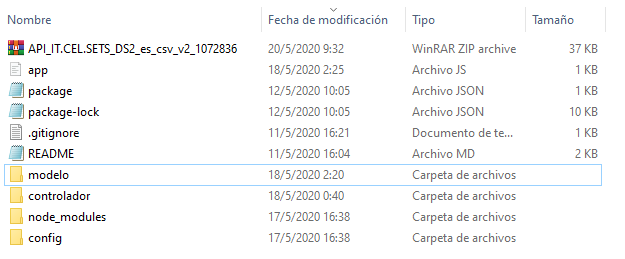
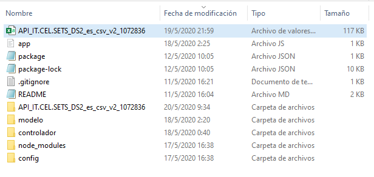
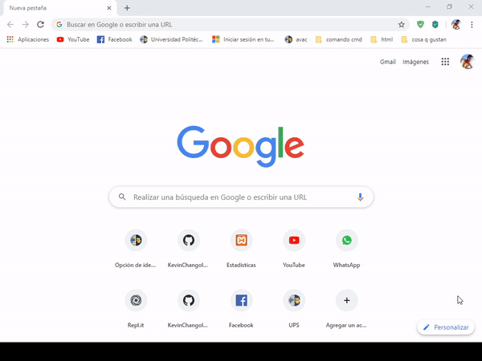
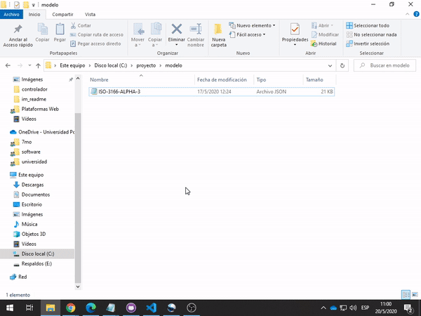

# Aplicación en NodeJS que permita leer los datos de las Suscripciones a telefonía celular móvil

_Crear una aplicación en NodeJS que permita leer los datos de las suscripciones a telefonía celular móvil, publicadas por el Banco
Mundial y publicar las estadísticas de un determinado país en un año específico._

## Comenzando 🚀

_Estas instrucciones te permitirán ejecutar de manera optima la aplicacion, sigue los pasos, para cualquier duda no dudes en contactarme kchangoluisa@hotmail.com._

### Pre-requisitos 📋

_Software que necesitas instalar._

```
Visual Studio Code
Node.js® 
```
_Librerias que necesitas instalar._

```
yargs
colors
csvtojson
```
_Archivos adicionales._
```
API_IT.CEL.SETS_DS2_es_csv_v2_1004854.csv
```
### Instalación 🔧

_👇Aqui 👇 encontraras un guia de instalacion facil de Visual Studio code y node.js._


_Solo ingresa <https://mega.nz/file/nqJShAiA#zm1fgaATnYchLenZnCqkgmmduVdXV3iN1JYQ6zJWsVo/> y sigue los pasos del pdf._

_Instalacion de libreria yargs, colors, csvtojson._

```
Ingresa a la terminal de VSC y digita:
npm install yargs colors csvtojson --save
```


_Base de datos de suscripciones a telefonía celular móvil._

_Solo da un clic en el enlace: <http://api.worldbank.org/v2/es/indicator/IT.CEL.SETS?downloadformat=csv/> y comenzara la descarga automaticamente._
```
Guarda en la carpeta raiz del proyecto
Te quedara algo como esto:
```

```
Descomprime el archivo API_IT.CEL.SETS_DS2_es_csv_v2_1004854.csv en la carpeta raiz del proyecto
Te quedara algo como esto:
```


## Ejecutando las pruebas ⚙️

La aplicacion cuenta con 2 comandos:
* Publicar
* Guardar

**Publicar**

La estructura para publicar en la aplicacion es la sigueinte:
node app.js publicar **-f** "nombre_archivo.csv" **-c** "[codigo_del_pais ](https://laendercode.net/es/3-letter-list.html)" **-y** Año

```
Ejemplo:
node app.js publicar -f "./API_IT.CEL.SETS_DS2_es_csv_v2_1004854.csv" -c "ECU" -y 2016  
```
  
  
Para visualizar los resultados en la web siga los siguientes pasos:
```
Abra su navegador digite en la seccion de url: localhost:3000
de clic en visualizar
```
 


**Guardar**

La estructura para guardar en la aplicacion es la siguiente:
node app.js guardar **-f** "nombre_archivo.csv" **-c** "[codigo_del_pais ](https://laendercode.net/es/3-letter-list.html)" **-y** Año **-o** "nombre_archivo_sin_extension"

```
Ejemplo:
node app.js guardar -f "./API_IT.CEL.SETS_DS2_es_csv_v2_1004854.csv" -c "ARE" -y 1982 -o consultas
```
 

## Construido con 🛠️

* [Visual Studio Code](https://code.visualstudio.com/) - Editor de código fuente.
* [Node js](https://nodejs.org/es/) - Entorno de ejecución para JavaScript.


## Versionado 📌

Usamos [SemVer](http://semver.org/) para el versionado. Para todas las versiones disponibles, mira los [tags en este repositorio](https://github.com/tu/proyecto/tags).

## Autores ✒️

_Menciona a todos aquellos que ayudaron a levantar el proyecto desde sus inicios_

* **Kevin Changoluisa** - *Trabajo Inicial* - [KevinChangoluisa](https://github.com/KevinChangoluisa)
* **Kevin Changoluisa** - *Documentación* - [KevinChangoluisa](https://github.com/KevinChangoluisa)

## Licencia 📄

Este proyecto está bajo la Licencia GNU General Public License v3.0 - mira el archivo [LICENSE.md](LICENSE) para detalles

## Expresiones de Gratitud 🎁

* Comenta a otros sobre este proyecto 📢
* Invita una cerveza 🍺 o un café ☕ a alguien del equipo. 
* Da las gracias públicamente 🤓.
* etc.

---
